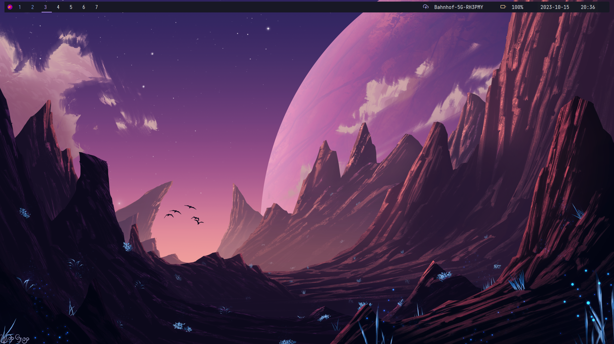

# Information 🃏

    

|Distro|[Arch](https://archlinux.org/)|
|:---:|:---:|
|WM|[BSPWM](https://github.com/baskerville/bspwm)|
|Bar|[Polybar](https://github.com/polybar/polybar)|
|Menu|[Rofi](https://github.com/davatorium/rofi)|
|Compositor|[Picom](https://archlinux.org/packages/community/x86_64/picom/)|
|Terminal|[Alacritty](https://github.com/alacritty/alacritty)|
|File Manager|[Thunar](https://archlinux.org/packages/extra/x86_64/thunar/) [Ranger](https://github.com/ranger/ranger)|
|Shell|[Zsh](https://archlinux.org/packages/extra/x86_64/zsh/)|
|Aur Helper|[Yay](https://github.com/Jguer/yay)|
|Screenshot Tool|[Flameshot](https://github.com/flameshot-org/flameshot)|

# Credits / Inspirations

- https://github.com/gh0stzk/dotfiles
- https://github.com/HynDuf/dotfiles
- https://github.com/uzuto/cosmos-dots
